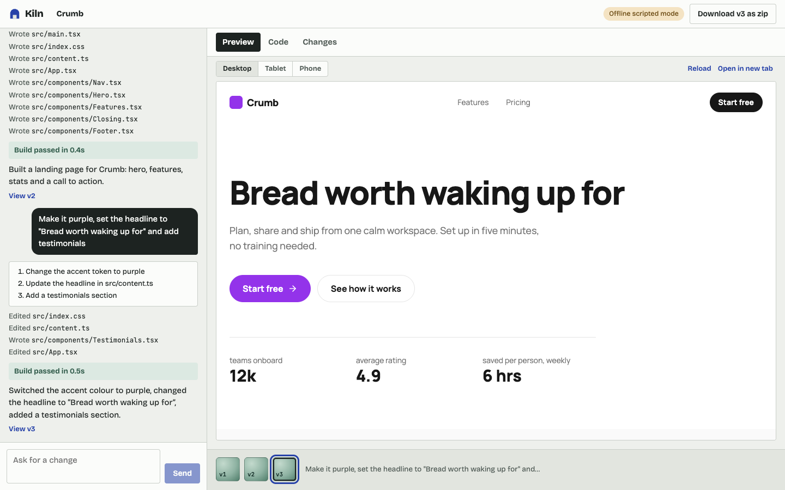
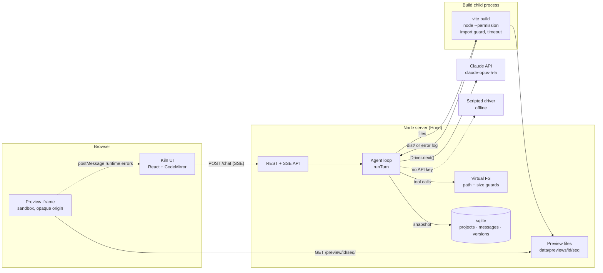
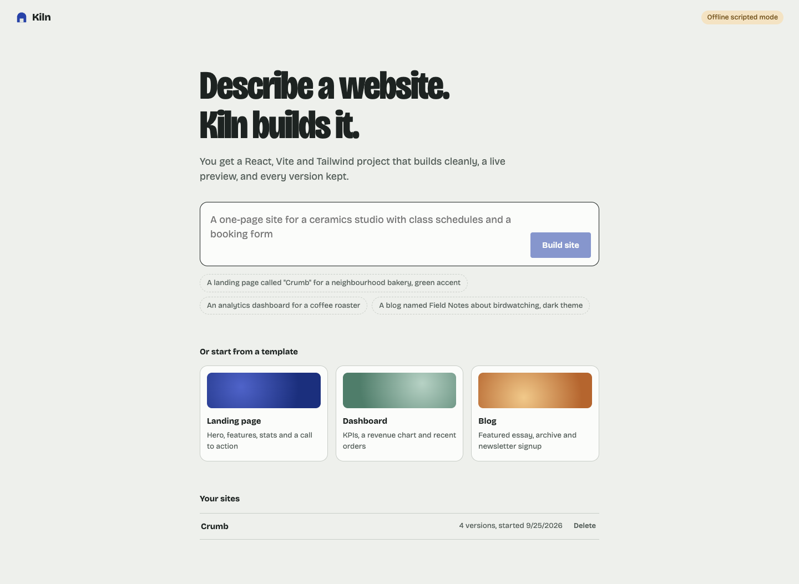
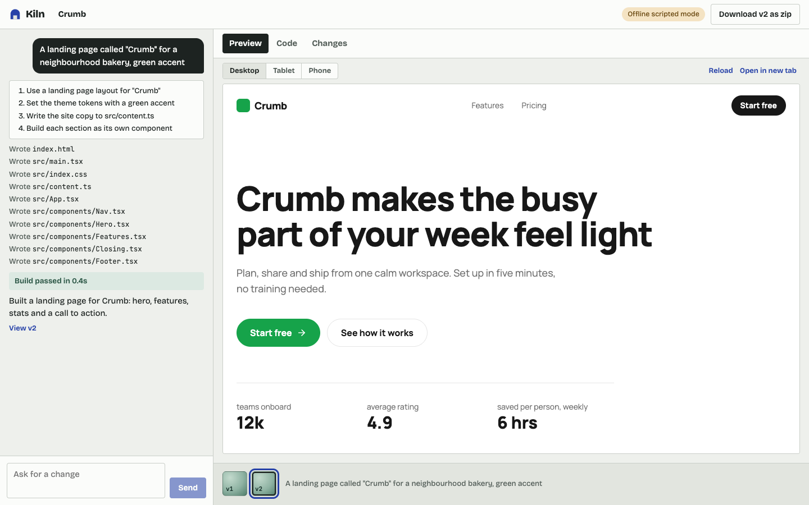
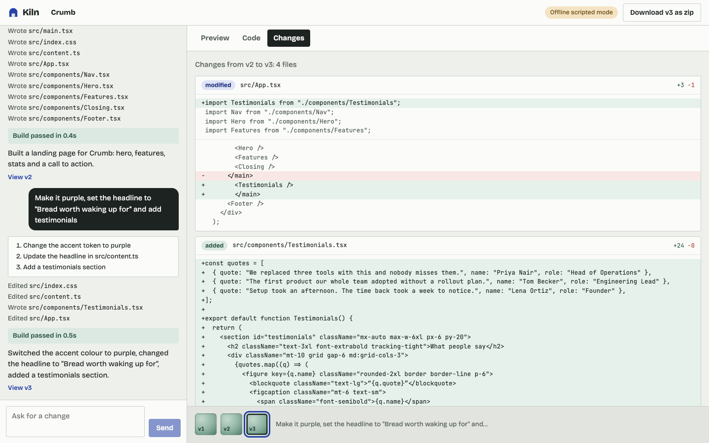
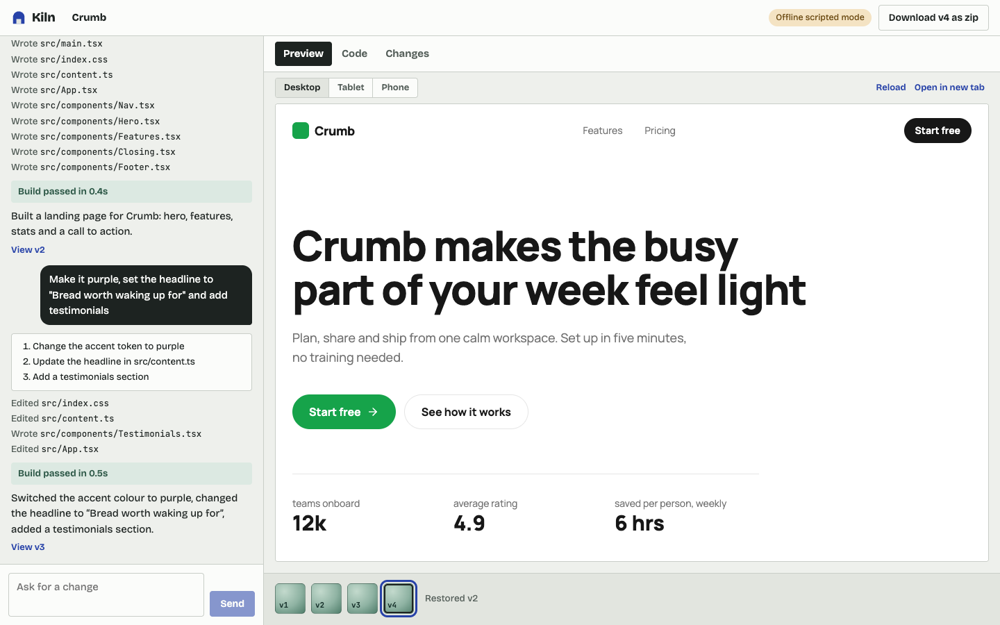
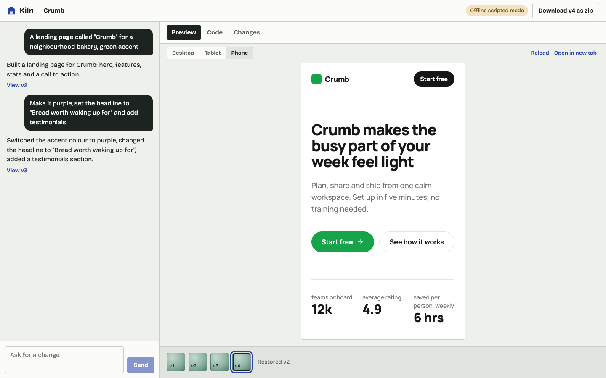

# Kiln

Describe a website and Kiln builds it. Claude writes a React + Vite + Tailwind CSS v4 project through file tools, Kiln runs a real `vite build` on every turn (sending build errors back to the model to fix), shows the result in a sandboxed live preview, and saves every turn as a version you can diff, restore or download.

It also runs **without an API key**: an offline scripted generator stands in for Claude and makes the same tool calls, so the whole app can be demoed and tested offline.



## Quick start

```sh
npm install
cp .env.example .env        # optional: add ANTHROPIC_API_KEY
npm run dev                 # API on :8787, UI on http://localhost:5173
```

Without `ANTHROPIC_API_KEY` (or with `KILN_SCRIPTED=true`) Kiln starts in **offline scripted mode**. That mode handles:

- new sites: "a landing page called "Crumb" for a bakery, green accent", "an analytics dashboard…", "a blog named Field Notes, dark theme"
- edits: "make it purple", "dark mode", `set the headline to "…"`, `rename to "…"`, "add testimonials / pricing / FAQ"
- "simulate a build error", which writes broken code first so you can watch the auto-fix loop recover

With a key, requests go to `claude-opus-5-5` (override with `KILN_MODEL`).

Production: `npm run build && npm start` serves the UI and API on one port.

## What it does

| | |
|---|---|
| Prompt → project | Claude plans, then uses `write_file` / `edit_file` (search/replace) / `delete_file` / `read_file` / `list_files` on a virtual filesystem |
| Streaming | Plan, file operations, build status and reply text stream to the chat over SSE |
| Build check | Every turn is built with `vite build` in an isolated temp dir, with a timeout; failures go back to the model for up to 2 fix attempts |
| Live preview | The built site in a sandboxed iframe, with desktop / tablet / phone widths and runtime errors reported back with a "Ask Kiln to fix it" button |
| Versions | One snapshot per turn in sqlite; timeline, per-file diffs, restore (as a new version, so restores are undoable) |
| Code | File tree and read-only CodeMirror viewer for any version |
| Export | Zip of any version with `package.json`, `vite.config.ts` and `tsconfig.json` added, so `npm i && npm run dev` works |
| Templates | Landing page, dashboard and blog starters |

## Architecture



A chat turn:

1. The server loads the head version's files into a `Vfs` and sends Claude the file contents, recent conversation and the request (`server/agent/loop.ts`).
2. Claude streams tool calls. Each input is validated with zod, then applied to the VFS. Errors (bad path, search text not found) go back as `is_error` tool results so the model can correct itself.
3. When the model stops, the files are built. A failed build appends the log as a new user message and the loop continues, at most twice.
4. The result is saved as a new version. If it built, its `dist/` becomes that version's preview.

### Decisions

**Preview is the build output, not a dev server per project.** The brief allowed a per-project Vite dev server or in-browser bundling. Kiln already has to run `vite build` to validate each turn, so the preview serves that output. There are no long-running processes to pool, leak or restart, previews of old versions cost nothing to keep, and what you see is exactly what the export builds. The cost is no HMR: a change shows up after a build of about 0.2 to 0.6 s for these projects. In-browser bundling was rejected because it would validate one thing (the browser bundler) and ship another (Vite + Tailwind).

**Generated code is bundled on the host but only executed in the browser.** Kiln owns `vite.config`, `package.json` and Tailwind config (v4 has no JS config), and the VFS refuses to write them, so no generated code runs in Node during the build. It runs only inside the preview iframe.

**Defence in depth for the build**, since bundling still reads files:

- `server/vfs.ts` rejects `..`, absolute paths, hidden files, reserved config files, unknown extensions, files over 200 KB, projects over 2 MB or 150 files.
- `server/build-worker.mjs` checks where every import actually resolves. Imports that land outside the project (for example `import x from "/etc/hosts?raw"`, which Vite would otherwise inline) and packages outside the allow list (`react`, `react-dom`, `lucide-react`) fail the build with a message the model can act on.
- The build runs as a separate `node --permission` process: reads limited to its temp dir and `node_modules`, writes to its temp dir, a scrubbed environment (no API keys), and `SIGKILL` after 60 s. Tailwind resolves CSS `@import`s outside Vite's resolver; the permission model is what stops those (see `tests/build.test.ts`).
- Previews are served with `Content-Security-Policy: sandbox allow-scripts …` and the iframe has no `allow-same-origin`, so a generated site gets an opaque origin even when opened in its own tab. It can't call Kiln's API or read its storage.

**One agent loop, two drivers.** `Driver.next()` returns one assistant turn. `ClaudeDriver` streams from the Messages API; `ScriptedDriver` returns canned tool calls. Everything else, including the VFS, build, auto-fix, versions and SSE, is shared, which is why the offline mode is a real test of the pipeline.

**Claude API usage** (`server/agent/claude.ts`): `claude-opus-5-5`, streaming, adaptive thinking with `effort: "high"` (Opus 5.5 defaults to `medium`), a cached system prompt, `tool_choice` left on auto (forced tool choice is rejected on this model), and `eager_input_streaming` on the file-writing tools with zod validation of every input. History within a turn is append-only, which keeps thinking blocks valid. Each new chat turn starts a fresh conversation containing the current files and a transcript of recent messages, so long projects don't carry every old tool call.

**Storage**: the built-in `node:sqlite`, so there is no native addon to compile. Each version stores the full file set as JSON. For projects capped at 2 MB that's simpler than a content-addressed store, and it makes restore and diff trivial.

## Project layout

```
server/
  app.ts            routes: projects, chat (SSE), versions, diff, restore, export, preview
  vfs.ts            virtual filesystem and path/size guards
  build.ts          sandboxed build runner; build-worker.mjs runs inside it
  db.ts, versions.ts
  agent/            loop.ts, tools.ts, claude.ts, scripted.ts
  templates/        landing, dashboard, blog
web/                Kiln's UI (React, CodeMirror)
tests/              vitest: vfs, versions, build sandbox, templates, agent loop, Claude driver, HTTP API
e2e/                Playwright flow in scripted mode
```

## Tests

```sh
npm run typecheck
npm test            # 47 unit/integration tests, including real sandboxed builds
npm run test:e2e    # builds the UI, starts the server in scripted mode, drives Chromium
```

CI runs all three on every push (`.github/workflows/ci.yml`).

## Screenshots

| | |
|---|---|
|  |  |
| Home: prompt, examples, templates | First turn: plan, files written, build passed |
|  |  |
| Per-version diff | Restoring v2 creates v4 |
|  | |
| Phone-width preview | |

## Not included

- Deploying to Vercel/Netlify and pushing to GitHub. Export is zip only; the zip is a complete Vite project that deploys anywhere.
- Editing code by hand in the viewer (read-only).
- Type checking generated code. `vite build` strips types, so a type error that isn't a syntax error doesn't fail the build.
- Accounts and multi-user access. Kiln is a single-user local app; don't expose it to the internet as is.
